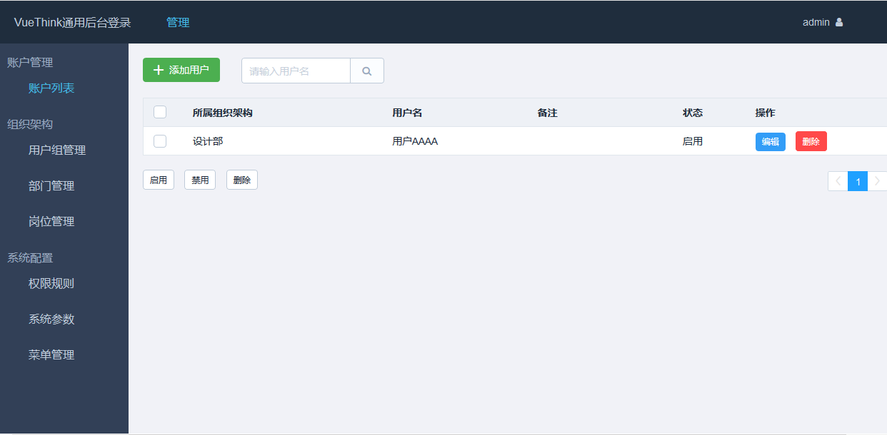

# VUE 框架

一、Element 饿了么开源

[链接](http://element-cn.eleme.io/#/zh-CN/component/transition)

二、 全能后台框架 vue-element-admin
[链接](https://github.com/PanJiaChen/vue-element-admin)

三、 通用后台 VueThink

- VueThink是一套基于Vue全家桶（Vue2.x + Vue-router2.x + Vuex）+ ThinkPHP5的前后端分离框架。

[链接](https://github.com/honraytech/VueThink)

